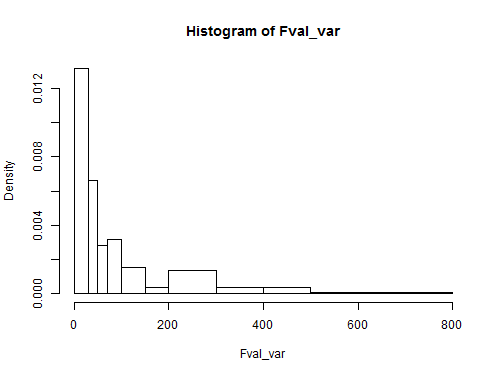
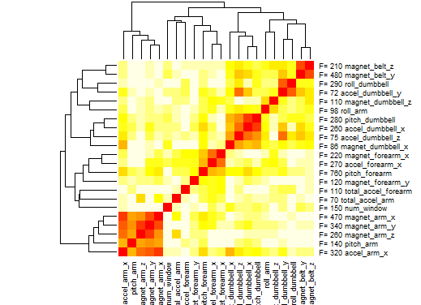

Predictive Modeling using Weight Lifting Exercise Dataset
========================================================


```r
dat1<-read.csv("C:/Users/Vlad/Documents/Coursera/Predictive/pml-training.csv")

## Preserving flag for potential outliers
dat1$flag<-ifelse(dat1$kurtosis_roll_belt !="",1,0)
## Deleting variables with mostly missing values  
dat1<-dat1[,sapply(dat1, function(x) sum(x=="" | is.na(x)==1))/nrow(dat1)<0.8]

library(caret)
```

```
## Warning: package 'caret' was built under R version 3.0.3
```

```
## Loading required package: lattice
## Loading required package: ggplot2
```

```r
library(ggplot2)
## 70% to training set, 30% to testing
inTrain<-createDataPartition(y=dat1$classe, p=0.7,list=F)
train<-dat1[inTrain,]
test<-dat1[-inTrain,]

## Filtering variables based on ANOVA F-value 
Fval<-function(n){
  a<-lm(train[,n]~train$classe )
  x<-unlist(summary.aov(a)[[1]]["F value"])[1]
  names(x)<-names(dat1)[n]
  return(x)
}
Fval_var<-NA*numeric(60)
for (i in 7:59) Fval_var[i]<-Fval(i)
```


```r
par(mfrow=c(1,1))
hist(Fval_var,breaks=c(0,30,50,70,100,150,200,300,400,500,800))
```

 


```r
## Heatmap of correlation of variables where Fval>70
value<-1-abs(cor(train[,!is.na(Fval_var) & Fval_var>70 ]))
rownames(value)<-paste("F=",signif(Fval_var[!is.na(Fval_var) & Fval_var>70],2), names(train)[!is.na(Fval_var) & Fval_var>70])
colnames(value)<-names(train)[!is.na(Fval_var) & Fval_var>70]
```

```r
heatmap(value,col = heat.colors(20),scale=c("none"))
```

 


```r
## Predicting variables names to be used below
retain_var2=names(train)[!is.na(Fval_var) & Fval_var>70]

## Keeping only classe variable and predictive variables in the datasets
train<-train[,c(retain_var2,"classe")]
test<-test[,c(retain_var2,"classe")]
```


```r
## Random Forest building prediction
modFit<-train(classe~.,method="rf",data=train,prox=T)
```

```
## Loading required package: randomForest
```

```
## Warning: package 'randomForest' was built under R version 3.0.3
```

```
## randomForest 4.6-7
## Type rfNews() to see new features/changes/bug fixes.
```

```
## Warning: package 'e1071' was built under R version 3.0.3
```


```r
modFit$finalModel
```

```
## 
## Call:
##  randomForest(x = x, y = y, mtry = param$mtry, proximity = ..1) 
##                Type of random forest: classification
##                      Number of trees: 500
## No. of variables tried at each split: 12
## 
##         OOB estimate of  error rate: 0.42%
## Confusion matrix:
##      A    B    C    D    E class.error
## A 3904    2    0    0    0    0.000512
## B    7 2645    6    0    0    0.004891
## C    0   14 2380    1    1    0.006678
## D    0    0   12 2238    2    0.006217
## E    1    5    1    6 2512    0.005149
```


```r
## Tabulation of prediction for the (30%) testing set
table(test$classe,predict(modFit,newdata=test))
```

```
##    
##        A    B    C    D    E
##   A 1673    1    0    0    0
##   B    3 1132    3    0    1
##   C    0    5 1020    1    0
##   D    0    0    6  957    1
##   E    0    1    1    0 1080
```

```r
(accuracy<-100*sum(test$classe==predict(modFit,newdata=test))/length(test$classe))
```

```
## [1] 99.61
```

```r
(errorrate<-100-accuracy)
```

```
## [1] 0.3908
```

```r
varImp(modFit)
```

```
## rf variable importance
## 
##   only 20 most important variables shown (out of 22)
## 
##                   Overall
## num_window         100.00
## magnet_dumbbell_z   32.10
## pitch_forearm       28.26
## magnet_dumbbell_x   19.99
## magnet_belt_y       18.68
## roll_dumbbell       13.84
## magnet_belt_z       13.64
## accel_dumbbell_y    12.72
## accel_dumbbell_z     9.53
## roll_arm             7.91
## accel_forearm_x      4.76
## accel_dumbbell_x     3.49
## pitch_dumbbell       2.14
## magnet_arm_y         2.11
## magnet_forearm_y     2.07
## magnet_forearm_x     2.04
## accel_arm_x          2.01
## magnet_arm_x         1.87
## pitch_arm            1.69
## magnet_arm_z         1.12
```
